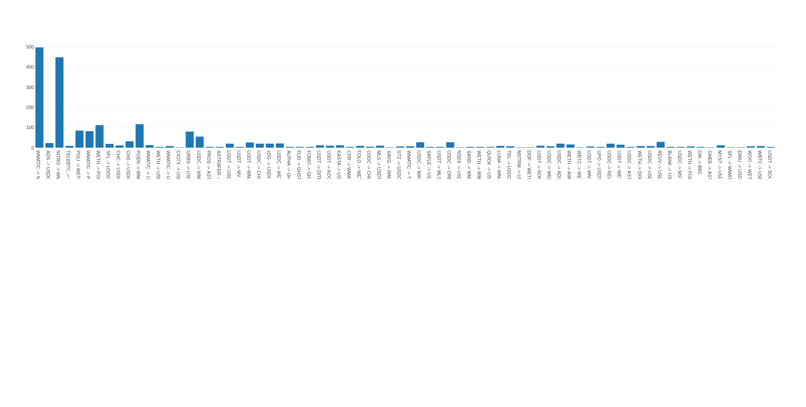

# QuickSwap Transaction Analyzer

A Python utility to monitor and analyze token swap transactions on the QuickSwap platform via the Polygon (Matic) network. The tool is designed to capture the latest token swaps and keep a count of swap occurrences for each token pair.

## Features:

- **Interacts with the QuickSwap Router** on the Polygon network.
- **Fetches the latest swap transactions** in real-time.
- **Decodes and extracts token information**.
- **Stores the frequency of token swaps** in a JSON file.
- **Shows a Chart with the Most Swaped Tokens by Count**

Screenshot: 


## Installation:

### Prerequisites:

Ensure you have Python 3.x installed. You'll also need the `web3` and `eth_abi` libraries. Install them using pip:

```bash
pip install web3 eth_abi


Usage:

    Setup ABI file: Ensure that you have the quickswap_router_address_abi.txt file in the same directory, which contains the ABI for the QuickSwap Router.

    Run the Script:

bash

python read_polygonchain_swaps.py

    Replace read_polygonchain_swaps.py with the name you've saved the script as.

    The script will continuously monitor the latest blocks, identify swap transactions, decode them to identify the token pair, and update the swap count in swap_counts.json.

You can Read the Charts with the app.py which Starts a Flask Instance to read the swap_counts.json file, and provides a Chart, based on Most Swaps.

Contributing:

If you'd like to contribute to the development of this tool, feel free to fork this repository, make your changes, and submit a pull request.
License:

MIT License
Disclaimer:

This tool is provided "as-is" and for educational purposes only. Ensure to do your own research and understand the code before using it in a production environment.
